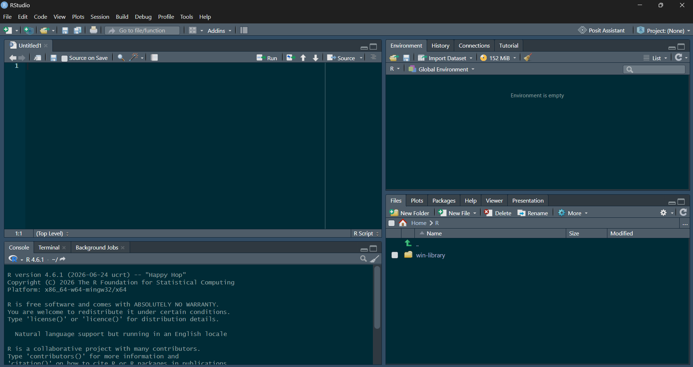

## Objectif

Ce guide explique comment installer R, installer RStudio, puis se familiariser avec l'interface pour écrire et exécuter du code.

::: {.callout-note}
## Mots importants

- **R** : le langage de programmation et le moteur de calcul. C'est lui qui exécute réellement le code.
- **RStudio** : un logiciel (IDE, environnement de développement) qui rend R plus facile à utiliser, avec une interface visuelle organisée en panneaux.
- **Script** : un fichier texte contenant du code R, généralement avec l'extension `.R`.
- **Console** : l'endroit où le code s'exécute et où les résultats s'affichent.
- **Module (Package)** : une extension qui ajoute des fonctionnalités à R, par exemple pour créer des graphiques ou analyser des données.
:::

::: {.callout-important}
R et RStudio sont deux installations distinctes, à faire dans cet ordre précis : **R d'abord**, puis **RStudio**. RStudio ne fonctionne pas sans R déjà installé sur l'ordinateur [[1](#ref-1)].
:::

## Ce dont vous avez besoin

- Un ordinateur (Windows, macOS ou Linux) avec les droits d'installation de logiciels.
- Une connexion Internet pour télécharger les fichiers d'installation.
- Environ 20 minutes pour l'installation complète.
- Sur Mac, connaître le type de puce de votre ordinateur (Apple Silicon comme M1, M2, M3, ou Intel), disponible dans le menu **Pomme > À propos de ce Mac**.

## Étape 1 : installer R

R est distribué par le **CRAN** (Comprehensive R Archive Network), le site officiel du projet R [[2](#ref-2)].

1. Ouvrez votre navigateur et allez à l'adresse suivante : <https://cran.r-project.org/>
2. Cliquez sur le lien correspondant à votre système d'exploitation :
   - **Download R for Windows**
   - **Download R for macOS**
   - **Download R for Linux**
3. Selon le système :
   - **Windows** : cliquez sur **base**, puis téléchargez le fichier d'installation le plus récent (par exemple `R-4.x.x-win.exe`).
   - **macOS** : téléchargez le fichier `.pkg` correspondant à votre puce. Choisissez le paquet **arm64** pour un Mac Apple Silicon (M1, M2, M3, la plupart des modèles depuis fin 2020), ou le paquet **x86_64** pour un Mac Intel plus ancien.
4. Ouvrez le fichier téléchargé et suivez les instructions d'installation, en conservant les options par défaut à chaque étape.
5. Une fois l'installation terminée, vous pouvez fermer l'assistant d'installation.

::: {.callout-tip}
Il n'est pas nécessaire d'ouvrir R directement après cette étape. RStudio s'en servira automatiquement en arrière-plan.
:::

## Étape 2 : installer RStudio

RStudio Desktop est distribué gratuitement par **Posit** [[3](#ref-3)].

1. Allez à l'adresse suivante : <https://docs.posit.co/ide/user/#rstudio-ide-oss-downloads>
2. Faites défiler la page jusqu'au tableau de téléchargement.
3. Le site détecte habituellement votre système d'exploitation automatiquement. Cliquez sur le bouton de téléchargement recommandé, ou choisissez manuellement la version correspondant à Windows, macOS ou Linux.
4. Ouvrez le fichier téléchargé :
   - **Windows** : lancez le fichier `.exe` et suivez l'assistant, en conservant les options par défaut.
   - **macOS** : ouvrez le fichier `.dmg`, puis glissez l'icône RStudio dans le dossier **Applications**.
5. Lancez RStudio depuis le menu Démarrer (Windows) ou le dossier Applications (macOS).

## Étape 3 : découvrir l'interface de RStudio

À l'ouverture, RStudio affiche généralement **quatre panneaux**. Leur disposition peut varier légèrement, mais leur rôle reste le même [[4](#ref-4)].

- **Script** (en haut à gauche) : pour écrire et enregistrer du code avant de l'exécuter.
- **Console** (en bas à gauche) : pour exécuter des commandes immédiatement et voir les résultats.
- **Environnement / Historique** (en haut à droite) : pour voir les objets créés pendant la session et l'historique des commandes exécutées.
- **Fichiers / Graphiques / Packages / Aide** (en bas à droite) : pour naviguer dans les fichiers, afficher les graphiques, gérer les extensions et consulter l'aide.

{width=90%}

::: {.callout-tip}

Quand vous installez RStudio pour la première fois, l'éditeur de code utilise le thème clair par défaut. L'image ci-dessus utilise plutôt le thème sombre **Solarized Dark**. Si vous voulez changer de thème, allez dans les options globales via **Tools > Global Options**, puis cliquez sur l'onglet **Appearance**. Faites défiler la liste **Editor theme**, en bas à gauche, et choisissez parmi les options disponibles.

:::

::: {.callout-note}

Si aucun panneau de script n'apparaît au démarrage, c'est normal : il faut d'abord créer un nouveau script, comme expliqué à l'étape suivante.

:::

## Étape 4 : créer votre premier script

Un script permet de conserver et réutiliser votre code, plutôt que de le taper directement dans la console à chaque fois.

1. Dans le menu, cliquez sur **File > New File > R Script**.
2. Vous pouvez aussi utiliser le raccourci clavier **Ctrl + Maj + N** (Windows/Linux) ou **Cmd + Maj + N** (Mac).
3. Un nouveau panneau vide apparaît en haut à gauche : c'est votre script.

## Étape 5 : exécuter votre premier code

Dans le script, écrivez :

```r
print("Bonjour, R et RStudio !")
```

Pour l'exécuter :

1. Placez le curseur sur cette ligne.
2. Appuyez sur **Ctrl + Entrée** (Windows/Linux) ou **Cmd + Entrée** (Mac).
3. Le résultat s'affiche dans la console, en bas à gauche :

```text
[1] "Bonjour, R et RStudio !"
```

::: {.callout-tip}
Le `[1]` qui apparaît devant le résultat indique la position de l'élément affiché. Il ne fait pas partie du texte lui-même : ne vous en préoccupez pas pour l'instant.
:::

## Étape 6 : faire un premier exercice

Modifiez le texte entre les guillemets pour y écrire votre prénom, puis exécutez à nouveau la ligne avec **Ctrl + Entrée** ou **Cmd + Entrée** :

```r
print("Bonjour, je m'appelle [votre_prénom] !")
```

## Étape 7 : enregistrer votre script

1. Cliquez sur **File > Save As**, ou utilisez le raccourci **Ctrl + S** (Windows/Linux) ou **Cmd + S** (Mac).
2. Choisissez un nom clair, par exemple `premiers_pas.R`.
3. Choisissez un dossier facile à retrouver sur votre ordinateur.

Un script `.R` peut être réouvert et modifié à tout moment depuis RStudio, en cliquant sur **File > Open File**.

## Étape 8 : organiser son travail avec un projet RStudio

Un **projet RStudio** regroupe vos scripts, données et résultats dans un même dossier, ce qui facilite grandement l'organisation, surtout pour un travail de recherche.

1. Cliquez sur **File > New Project**.
2. Choisissez **New Directory**.
3. Sélectionnez **New Project**.
4. Donnez un nom au dossier, par exemple `mon_premier_projet`.
5. Choisissez l'emplacement où créer ce dossier.
6. Cliquez sur **Create Project**.

RStudio se relance alors avec ce dossier comme espace de travail. Tous les scripts créés par la suite peuvent y être enregistrés.

::: {.callout-important}
Travailler à l'intérieur d'un projet RStudio évite les problèmes fréquents liés au chemin des fichiers, notamment lorsqu'un script cherche à charger un fichier de données.
:::

## Étape 9 : installer un premier module

Un module ajoute des fonctionnalités à R. Par exemple, le module `ggplot2` sert à créer des graphiques.

Dans la console, écrivez la commande suivante, puis appuyez sur **Entrée** :

```r
install.packages("ggplot2")
```

L'installation peut prendre quelques secondes à quelques minutes selon la connexion Internet. Une fois terminée, le module doit être chargé avant chaque utilisation, dans un script ou dans la console :

```r
library(ggplot2)
```

::: {.callout-note}
`install.packages()` ne s'exécute généralement qu'une seule fois par ordinateur. `library()`, en revanche, doit être exécuté à chaque nouvelle session de travail où le module est nécessaire.
:::

## Bonnes pratiques pour débuter

- Travaillez toujours à l'intérieur d'un projet RStudio plutôt que dans des fichiers dispersés.
- Écrivez votre code dans un script, pas seulement dans la console, pour pouvoir le réutiliser.
- Enregistrez votre script régulièrement.
- Lisez attentivement les messages d'erreur en rouge dans la console : ils indiquent souvent la ligne concernée et la nature du problème.
- Ajoutez des commentaires dans votre code à l'aide du symbole `#`, par exemple : `# Ceci est un commentaire`.
- Évitez d'utiliser des accents ou des espaces dans les noms de fichiers et de dossiers de votre projet.

## Vérification des acquis

À ce stade, vous devriez être capable de :

- Installer R, puis RStudio, dans le bon ordre.
- Reconnaître les quatre panneaux principaux de RStudio.
- Créer, exécuter et enregistrer un script R.
- Créer un projet RStudio pour organiser votre travail.
- Installer et charger un module.

::: {.callout-tip}
## Prochaine étape
Essayez de créer un nouveau projet RStudio, d'y créer un script nommé `essai_r.R`, d'installer le module `ggplot2`, puis d'exécuter une ligne de code qui affiche une phrase de votre choix.
:::

## Références

::: {#ref-1}
1\. Datanovia — [Installer R et RStudio : configuration Windows, Mac et Linux](https://www.datanovia.com/fr/learn/programming/setup/install-r-and-rstudio)
:::

::: {#ref-2}
2\. CRAN — [The Comprehensive R Archive Network](https://cran.r-project.org/)
:::

::: {#ref-3}
3\. Posit — [Téléchargement de RStudio Desktop](https://posit.co/download/rstudio-desktop/)
:::

::: {#ref-4}
4\. Datanovia — [3 Premiers pas avec R et RStudio](https://amaddi.quarto.pub/02-r-rstudio.html)
:::
