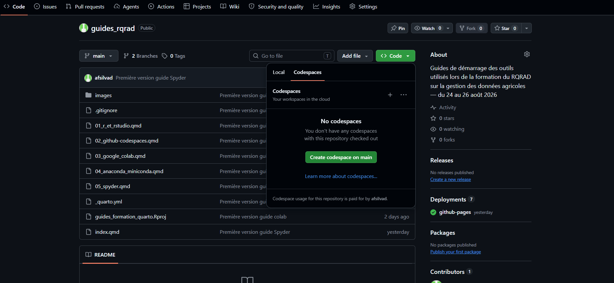
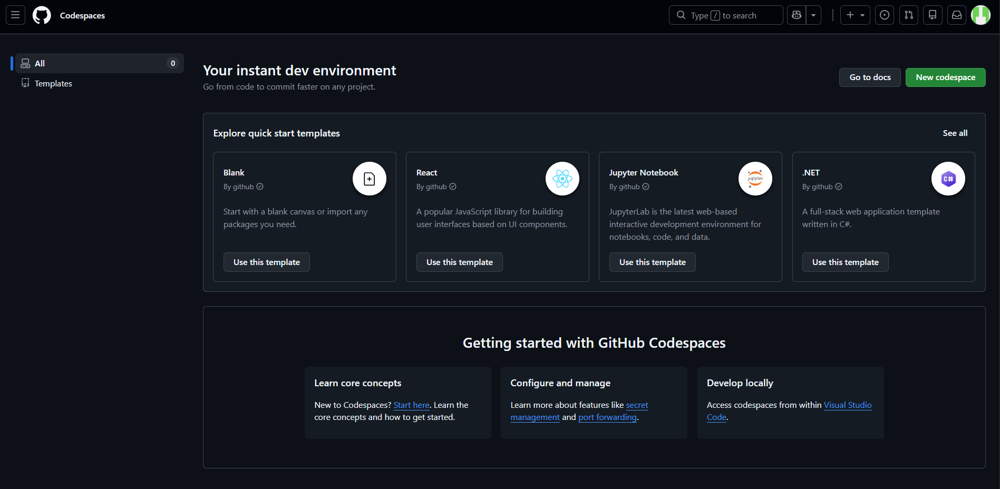

## Objectif

Ce guide explique ce qu'est GitHub Codespaces, comment créer un codespace pour un dépôt existant, et comment commencer à travailler avec. Il s'adresse aux personnes qui commencent totalement avec cet outil.

::: {.callout-note}
## Mots importants

- **Codespace** : un environnement de développement complet, hébergé dans le cloud par GitHub, accessible depuis un navigateur ou Visual Studio Code.
- **Dépôt (repository)** : le dossier de projet hébergé sur GitHub, contenant le code et son historique de versions.
- **Conteneur** : l'environnement isolé dans lequel le codespace s'exécute, avec ses propres outils déjà installés.
- **Devcontainer** : un fichier de configuration optionnel qui définit précisément quels outils et paramètres un codespace doit contenir.
- **Gabarit (template)** : un point de départ préconfiguré (par exemple Django, Node.js ou Jupyter), proposé par GitHub pour créer rapidement un codespace sans dépôt existant.
- **VS Code** : l'éditeur de code qui s'affiche à l'intérieur du codespace, que ce soit dans le navigateur ou en application locale.
:::

## Qu'est-ce qu'un codespace ?

Un codespace est un ordinateur virtuel, préconfiguré, qui contient déjà Git, un terminal et souvent un langage de programmation comme Python. Il permet de coder sans rien installer sur son propre ordinateur : tout se passe dans le navigateur ou dans Visual Studio Code connecté à distance [[1](#ref-1)].

::: {.callout-tip}
Un codespace est particulièrement utile si votre ordinateur est peu puissant, si vous changez souvent d'appareil, ou si vous voulez essayer un projet sans configurer un environnement local complet.
:::

## Ce dont vous avez besoin

- Un compte GitHub actif.
- Un navigateur Internet récent.
- Une connexion Internet stable pendant l'utilisation du codespace.
- Optionnel : Visual Studio Code installé localement, si vous préférez travailler depuis l'application plutôt que depuis le navigateur.

::: {.callout-important}
GitHub Codespaces offre un quota d'utilisation gratuit limité chaque mois pour les comptes personnels (120 heures-cœur, soit environ 60 heures sur une machine à 2 cœurs, plus 15 Go de stockage) [[2](#ref-2)]. Au-delà de ce quota, l'utilisation est facturée. Vérifiez votre utilisation dans les paramètres de votre compte si vous l'utilisez régulièrement.
:::

## Étape 1 : accéder à un dépôt

Un codespace se crée le plus souvent à partir d'un dépôt GitHub existant.

1. Connectez-vous à votre compte sur [github.com](https://github.com).
2. Ouvrez le dépôt que vous voulez utiliser, ou créez-en un nouveau si nécessaire (**+ > New repository**).

Si vous n'avez pas encore de projet, GitHub propose aussi des modèles de démarrage rapide pensés spécifiquement pour Codespaces [[3](#ref-3)].

## Étape 2 : créer un codespace

1. Sur la page principale du dépôt, cliquez sur le bouton vert **Code**.
2. Sélectionnez l'onglet **Codespaces**.
3. Cliquez sur **Create codespace on main** (ou le nom de la branche affichée).

{width=80%}

GitHub effectue alors quatre opérations automatiquement [[4](#ref-4)] :

1. Une machine virtuelle et un espace de stockage sont attribués.
2. Un conteneur est créé.
3. Une connexion à ce conteneur est établie.
4. Une configuration finale s'exécute si le dépôt en définit une.

Ce processus prend généralement entre quelques secondes et une ou deux minutes.

::: {.callout-important}
## Si le bouton vert « Code » n'apparaît pas

Le bouton **Code** peut ne pas apparaître dans certains cas, par exemple immédiatement après la création d'un nouveau répertoire (dépôt) encore vide, ou selon les permissions accordées sur le dépôt. Si c'est votre cas, procédez plutôt ainsi :

1. Allez à l'adresse suivante : [github.com/features/codespaces](https://github.com/features/codespaces)
2. Cliquez sur le bouton **Get started for free**.
3. Une fois connecté à votre compte, cliquez sur le bouton **New codespace**.
4. Sur cette page, associez le codespace au dépôt souhaité en le sélectionnant dans la liste, ou dans le champ de recherche prévu à cet effet.
5. Choisissez la branche voulue (généralement `main`), puis confirmez la création.

Cette méthode revient au même résultat que le bouton **Code**, mais fonctionne aussi lorsque ce bouton n'est pas visible sur la page du dépôt [[2](#ref-2)].
:::

{width=80%}

::: {.callout-tip}
## Créer un codespace à partir d'un gabarit (sans dépôt existant)

Sur la page [**New codespace**](https://github.com/codespaces), GitHub propose aussi des **gabarits (templates)** prêts à l'emploi, correspondant à différents langages ou usages, par exemple Django, Node.js, ou encore **Jupyter Notebook**. Ces gabarits créent automatiquement un nouveau dépôt minimal déjà configuré pour l'usage choisi, ce qui permet de démarrer sans avoir à préparer un dépôt au préalable [[2](#ref-2)].

Ceci est particulièrement utile si vous voulez seulement essayer Codespaces rapidement, ou si vous cherchez un environnement Jupyter déjà prêt sans devoir configurer manuellement un dépôt Python.
:::

## Étape 3 : découvrir l'interface

Une fois le codespace prêt, une interface **Visual Studio Code** s'ouvre, directement dans votre navigateur.

- **Explorateur de fichiers** (à gauche) : affiche tous les fichiers du dépôt.
- **Zone d'édition** (au centre) : pour ouvrir et modifier les fichiers.
- **Terminal** (en bas) : une ligne de commande déjà connectée à l'environnement du codespace, avec Git préinstallé.
- **Barre d'activité** (tout à gauche) : icônes pour accéder à la recherche, au contrôle de version Git, aux extensions, etc.

Pour ouvrir le terminal s'il n'est pas visible, utilisez le menu **Terminal > New Terminal**.

## Étape 4 : exécuter une première commande

Dans le terminal, écrivez :

```bash
echo "Bonjour depuis mon codespace"
```

Appuyez sur **Entrée**. Le message s'affiche directement dans le terminal, confirmant que l'environnement fonctionne.

Si le codespace contient Python, vous pouvez aussi tester :

```bash
python3 --version
```

## Étape 5 : modifier un fichier et enregistrer les changements

1. Dans l'explorateur de fichiers, ouvrez un fichier existant, ou créez-en un nouveau avec le bouton **New File**.
2. Faites une petite modification, par exemple ajouter une ligne de texte.
3. Enregistrez avec **Ctrl + S** (Windows/Linux) ou **Cmd + S** (Mac).

Le fichier est modifié dans le codespace, mais pas encore renvoyé vers GitHub. C'est l'objectif de l'étape suivante.

## Étape 6 : enregistrer les changements sur GitHub

Si vous êtes déjà familier avec la gestion de versions dans Git, le fonctionnement est le même que sur un ordinateur local, puisque Git est déjà installé et configuré dans le Codespace.

Dans le terminal :

```bash
git add .
git commit -m "Premier essai dans Codespaces"
git push
```

::: {.callout-note}
Puisque le codespace est déjà connecté à votre compte GitHub, aucune configuration supplémentaire d'identifiants n'est généralement nécessaire pour `git push`, contrairement à un dépôt cloné localement.
:::

:::{.callout-tip}

Si vous n'êtes pas familier avec la gestion de versions dans Git, vous pouvez vous y initier grâce aux [ressources d'apprentissage offertes sur GitHub](https://docs.github.com/fr/get-started/start-your-journey/git-and-github-learning-resources#using-git).

:::

## Étape 7 : suspendre ou arrêter le codespace

Un codespace continue de consommer des ressources tant qu'il reste actif.

- Fermer l'onglet du navigateur met le codespace en pause automatiquement après une période d'inactivité.
- Pour l'arrêter manuellement : allez sur [github.com/codespaces](https://github.com/codespaces), trouvez votre codespace dans la liste, cliquez sur les trois points **...**, puis choisissez **Stop codespace**.

::: {.callout-tip}

Arrêter un codespace ne supprime pas votre travail. Vos fichiers restent disponibles au prochain démarrage, à condition que les changements aient bien été enregistrés avec `git commit`, ou simplement sauvegardés dans le système de fichiers du codespace.

:::

## Étape 8 : reprendre un codespace existant

1. Allez sur [github.com/codespaces](https://github.com/codespaces).
2. Cliquez sur le nom du codespace que vous voulez reprendre.
3. L'environnement se relance avec les fichiers tels que vous les aviez laissés.

## Étape 9 : supprimer un codespace

Lorsque vous n'avez plus besoin d'un codespace, il est recommandé de le supprimer pour libérer votre quota.

1. Allez sur [github.com/codespaces](https://github.com/codespaces).
2. Cliquez sur les trois points **...** à côté du codespace concerné.
3. Choisissez **Delete**.

::: {.callout-important}

Supprimer un codespace efface l'environnement, mais pas le dépôt GitHub associé. Si vos changements ont déjà été envoyés avec `git push`, ils restent conservés dans le dépôt. Si des changements n'ont pas été envoyés, ils sont perdus définitivement.

:::

## Bonnes pratiques pour débuter

- Envoyez régulièrement vos changements avec `git push`, plutôt que de compter uniquement sur le codespace pour conserver votre travail.
- Arrêtez les codespaces inutilisés pour éviter de consommer votre quota gratuit inutilement.
- Donnez un nom clair à vos dépôts avant de créer un codespace, car le nom du codespace en dépend.
- Si le bouton vert **Code** n'apparaît pas sur un dépôt tout juste créé, utilisez plutôt la page **New codespace** accessible depuis `github.com/features/codespaces`.
- Supprimez les codespaces devenus inutiles plutôt que de les laisser s'accumuler.

## Vérification des acquis

À ce stade, vous devriez être capable de :

- Expliquer ce qu'est un codespace, en une phrase simple.
- Créer un codespace à partir d'un dépôt existant, via le bouton **Code** ou via la page **New codespace**.
- Créer un codespace à partir d'un gabarit, par exemple Jupyter, sans dépôt préexistant.
- Reconnaître les éléments principaux de l'interface Visual Studio Code dans le navigateur.
- Modifier un fichier et envoyer les changements vers GitHub avec `git push`.
- Arrêter, reprendre et supprimer un codespace.

::: {.callout-tip}
## Prochaine étape
Créez un nouveau dépôt vide sur GitHub, ouvrez-y un codespace, créez un fichier `essai.md`, écrivez-y une phrase, puis envoyez ce changement vers GitHub avec `git add`, `git commit` et `git push`.
:::

## Références

::: {#ref-1}
1\. GitHub Docs — [Qu'est-ce que GitHub Codespaces ?](https://docs.github.com/fr/codespaces/about-codespaces/what-are-codespaces)
:::

::: {#ref-2}
2\. GitHub — [GitHub Codespaces](https://github.com/features/codespaces)
:::

::: {#ref-3}
3\. GitHub Docs — [Démarrage rapide pour GitHub Codespaces](https://docs.github.com/fr/codespaces/quickstart)
:::

::: {#ref-4}
4\. Microsoft Learn — [Le cycle de vie des codespaces](https://learn.microsoft.com/fr-fr/training/modules/code-with-github-codespaces/2-codespace-lifecycle)
:::
