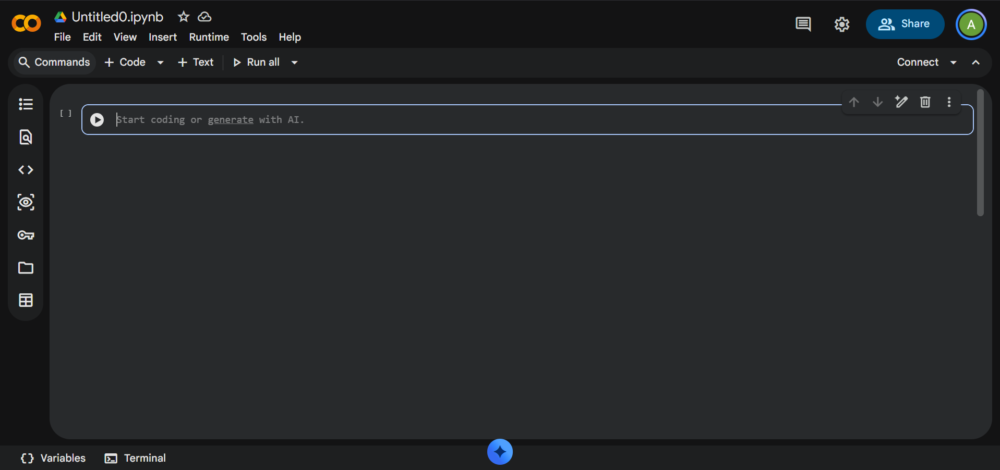

## Objectif

Ce guide explique comment créer un compte Google, ouvrir Google Colab et exécuter un premier programme en Python.

## Qu'est-ce que Google Colab ?

Google Colab, aussi appelé **Colaboratory**, est un outil en ligne qui permet d'écrire et d'exécuter du code Python directement dans un navigateur Internet.

Aucune installation de Python n'est nécessaire sur votre ordinateur. Les fichiers créés dans Colab sont appelés des **notebooks** et sont enregistrés dans Google Drive, au format `.ipynb` [[1](#ref-1)].

::: {.callout-note}
## Mots importants

- **Navigateur** : application pour accéder à Internet, par exemple Google Chrome, Firefox, Edge ou Safari.
- **Compte Google** : compte utilisé notamment pour Gmail, Google Drive et Google Colab.
- **Notebook** : document de travail qui peut contenir du texte, du code et des résultats.
- **Cellule** : petite zone dans un notebook. Une cellule peut contenir du code ou du texte.
- **Python** : langage de programmation couramment utilisé pour l'analyse de données, l'automatisation et l'intelligence artificielle.
:::

## Ce dont vous avez besoin

Avant de commencer, vérifiez que vous avez :

- Un ordinateur connecté à Internet.
- Un navigateur Internet récent.
- Une adresse courriel ou un numéro de téléphone pour créer un compte Google, si nécessaire.
- Environ 15 minutes pour effectuer les premières étapes.

::: {.callout-warning}
Ne communiquez jamais votre mot de passe à une autre personne.
:::

## Étape 1 : créer un compte Google

Si vous possédez déjà une adresse Gmail ou un compte Google professionnel ou institutionnel, passez directement à l'étape suivante.

1. Ouvrez votre navigateur Internet.
2. Accédez à l'adresse suivante : [accounts.google.com/signup](https://accounts.google.com/signup)
3. Entrez votre prénom et votre nom.
4. Choisissez un nom d'utilisateur. Il formera généralement votre adresse Gmail.
5. Créez un mot de passe robuste et conservez-le dans un endroit sûr.
6. Suivez les étapes de vérification demandées par Google.
7. Une fois le compte créé, connectez-vous à ce compte dans votre navigateur.

## Étape 2 : ouvrir Google Colab

1. Dans votre navigateur, ouvrez le lien suivant : [colab.research.google.com](https://colab.research.google.com/)
2. Connectez-vous avec votre compte Google si Google le demande.
3. La page d'accueil de Colab s'affiche.
4. Cliquez sur **Nouveau notebook**.

Un nouveau document s'ouvre dans un nouvel onglet du navigateur.

{width=90%}

::: {.callout-tip}
Un notebook Colab est un fichier de travail. Il peut être recherché dans Google Drive, partagé comme un document Google et téléchargé depuis le menu **Fichier** [[1](#ref-1)].
:::

## Étape 3 : renommer le notebook

Il est recommandé de donner un nom clair à chaque notebook.

1. En haut à gauche de la page, cliquez sur le nom par défaut, par exemple `Untitled0.ipynb`.
2. Remplacez-le par un nom significatif, par exemple : `premiers_pas_colab.ipynb`
3. Appuyez sur la touche **Entrée**.

Le notebook est enregistré dans Google Drive.

## Étape 4 : comprendre l'écran

Un notebook contient plusieurs **cellules**.

### Cellule de code

Une cellule de code sert à écrire des instructions en Python. Elle possède habituellement un bouton triangulaire à gauche. Ce bouton permet d'exécuter le code.

### Cellule de texte

Une cellule de texte sert à ajouter des titres, des explications ou des notes. Pour ajouter une cellule de texte, cliquez sur le bouton **+ Texte** situé dans la partie supérieure de la page.

### Ajouter une cellule de code

Pour ajouter une nouvelle cellule de code, cliquez sur le bouton **+ Code**.

## Étape 5 : exécuter votre premier programme

Dans la première cellule de code, écrivez :

```python
print("Bonjour, Google Colab !")
```

Ensuite :

1. Cliquez sur le bouton triangulaire situé à gauche de la cellule.
2. Attendez quelques secondes.
3. Le résultat apparaît sous la cellule.

Vous devriez voir :

```
Bonjour, Google Colab !
```

Vous venez d'exécuter votre premier programme Python.

::: {.callout-tip}
Vous pouvez aussi exécuter une cellule avec le raccourci clavier **Maj + Entrée**. Pour débuter, utilisez d'abord le bouton triangulaire : il est plus facile à identifier.
:::

## Étape 6 : faire un premier exercice

Modifiez le texte entre les guillemets pour y écrire votre prénom :

```python
print("Bonjour, je m'appelle [votre_prénom] !")
```

Par exemple :

```python
print("Bonjour, je m'appelle Justine !")
```

Exécutez de nouveau la cellule avec le bouton triangulaire.

## Étape 7 : ajouter du texte explicatif

Un bon notebook contient du code, mais aussi des explications.

1. Cliquez sur **+ Texte**.
2. Écrivez un titre, par exemple :

```markdown
# Mon premier notebook

Ce notebook contient mes premiers essais avec Python.
```

3. Cliquez en dehors de la cellule ou utilisez le bouton d'exécution pour afficher le texte mis en forme.

Le symbole `#` crée un titre principal dans une cellule de texte.

## Étape 8 : enregistrer et retrouver son travail

Colab enregistre habituellement les modifications dans Google Drive.

Pour retrouver un notebook plus tard :

1. Ouvrez Google Drive : [drive.google.com](https://drive.google.com/)
2. Utilisez la barre de recherche et saisissez le nom de votre notebook.
3. Vous pouvez aussi ouvrir Colab, puis utiliser **Fichier > Ouvrir le notebook** ou **Fichier > Rechercher des notebooks dans Drive** [[1](#ref-1)].

## Étape 9 : télécharger une copie

Il est utile de conserver une copie de son travail sur son ordinateur.

1. Dans Colab, cliquez sur **Fichier**.
2. Choisissez l'option pour télécharger le notebook.
3. Enregistrez le fichier sur votre ordinateur.

Le fichier téléchargé aura généralement l'extension `.ipynb`, qui est le format standard des notebooks Jupyter.

## Étape 10 : partager un notebook

Un notebook Colab peut être partagé de façon similaire à un document Google.

1. Cliquez sur le bouton **Partager**, en haut à droite.
2. Ajoutez l'adresse courriel des personnes concernées.
3. Choisissez leur niveau d'accès :
   - **Lecteur** : peut consulter le notebook.
   - **Commentateur** : peut consulter et ajouter des commentaires.
   - **Éditeur** : peut modifier le notebook.
4. Cliquez sur **Envoyer**.

::: {.callout-important}
Vérifiez toujours que vous partagez le bon fichier et avec les bonnes personnes.
:::

## Bonnes pratiques pour débuter

- Donnez un nom clair à chaque notebook.
- Ajoutez un titre et une courte explication au début du document.
- Exécutez les cellules de code dans l'ordre, de haut en bas.
- Lisez attentivement les messages d'erreur : ils indiquent souvent la ligne à corriger.
- Conservez une copie importante de votre notebook sur votre ordinateur.
- Évitez de partager des données personnelles, confidentielles ou sensibles.
- Fermez les onglets Colab inutilisés lorsque vous avez terminé.

## Vérification des acquis

À ce stade, vous devriez être capable de :

- Créer ou utiliser un compte Google.
- Accéder à Google Colab.
- Créer et renommer un notebook.
- Écrire et exécuter une cellule Python.
- Ajouter une cellule de texte.
- Retrouver, télécharger et partager un notebook.

::: {.callout-tip}
## Prochaine étape
Essayez de créer un notebook appelé `essai_python.ipynb`, ajoutez un titre, puis exécutez une cellule qui affiche une phrase de votre choix.
:::

## Références

::: {#ref-1}
1\. Google Research — [Qu'est-ce que Colaboratory ?](https://research.google.com/colaboratory/faq.html?hl=fr)
:::
