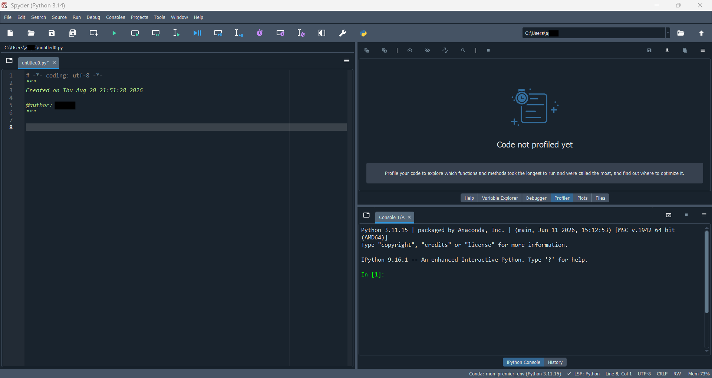
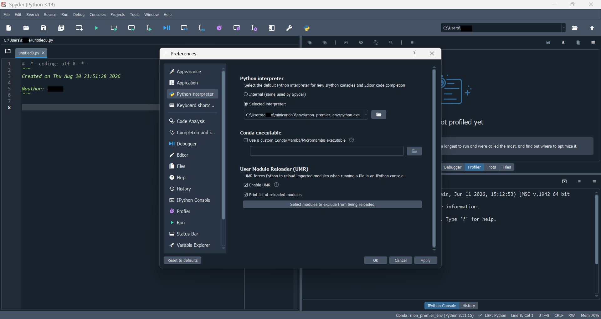

## Objectif

Ce guide explique comment installer Spyder correctement à l'aide de conda, puis comment le connecter à différents environnements de projet, sans devoir réinstaller Spyder à chaque fois. Il s'adresse aux personnes qui commencent totalement avec Spyder, mais qui ont déjà installé conda (Miniconda ou Anaconda).

::: {.callout-note}
Ce guide suppose que Miniconda ou Anaconda est déjà installé sur votre ordinateur. Si ce n'est pas le cas, consultez d'abord le guide de démarrage avec Anaconda et Miniconda.
:::

::: {.callout-note}
## Mots importants

- **Spyder** : un environnement de développement (IDE) conçu pour la programmation scientifique en Python, avec un éditeur de code, une console et un explorateur de variables.
- **Interpréteur Python** : le programme qui exécute réellement le code Python. Chaque environnement conda possède son propre interpréteur.
- **Spyder-kernels** : un petit paquet qui permet à Spyder de communiquer avec l'interpréteur Python d'un environnement donné.
- **Environnement dédié à Spyder** : un environnement conda qui ne contient que Spyder lui-même, séparé des environnements utilisés pour vos projets.
:::

## Pourquoi installer Spyder dans son propre environnement

Il est tentant d'installer Spyder directement dans l'environnement `base`, ou dans chaque environnement de projet créé. Ce n'est cependant pas la méthode recommandée par l'équipe de Spyder elle-même [[1](#ref-1)].

::: {.callout-important}
N'installez jamais Spyder dans l'environnement `base`, et éviter de le réinstaller dans chaque environnement de projet. Installer Spyder à répétition consomme beaucoup d'espace disque et de temps, et peut provoquer des conflits entre paquets d'un environnement à l'autre [[2](#ref-2)].
:::

La bonne pratique consiste à :

1. Créer **un seul environnement dédié** à Spyder, par exemple nommé `spyder-env`.
2. Installer uniquement le petit paquet `spyder-kernels` dans chacun de vos environnements de projet.
3. Lancer Spyder depuis `spyder-env`, puis lui indiquer, à l'intérieur de l'interface, quel environnement de projet utiliser pour exécuter le code.

Cette approche permet de toujours lancer Spyder de la même façon, peu importe le projet sur lequel vous travaillez, tout en gardant vos environnements de projet légers et isolés [[3](#ref-3)].

## Ce dont vous avez besoin

- Miniconda ou Anaconda déjà installé sur votre ordinateur.
- Un terminal (ou Anaconda Prompt sur Windows).
- Une connexion Internet pour télécharger Spyder et ses dépendances.
- Environ 10 minutes pour l'installation initiale.

## Étape 1 : créer l'environnement dédié à Spyder

Ouvrez un terminal (ou Anaconda Prompt sur Windows) et exécutez :

```bash
conda create -c conda-forge -n spyder-env spyder
```

Cette commande crée un nouvel environnement nommé `spyder-env`, en installant Spyder depuis le canal `conda-forge`, généralement plus à jour [[1](#ref-1)].

::: {.callout-tip}
Si vous voulez aussi que Spyder reconnaisse automatiquement des paquets scientifiques courants (`numpy`, `scipy`, `pandas`, `matplotlib`, `sympy`, `cython`) directement dans son propre environnement, utilisez plutôt :

```bash
conda create -c conda-forge -n spyder-env spyder numpy scipy pandas matplotlib sympy cython
```

Ce n'est toutefois pas obligatoire : ces paquets peuvent tout aussi bien vivre uniquement dans vos environnements de projet [[1](#ref-1)].
:::

Répondez `y` lorsque conda demande une confirmation.

## Étape 2 : configurer le canal conda-forge par défaut (recommandé)

Pour que les futures mises à jour de Spyder restent cohérentes avec le canal utilisé à l'installation, activez l'environnement puis configurez-le :

```bash
conda activate spyder-env
conda config --env --add channels conda-forge
conda config --env --set channel_priority strict
```

Cette étape n'est pas obligatoire pour démarrer, mais elle évite des conflits de paquets lors de mises à jour futures [[1](#ref-1)].

## Étape 3 : ouvrir Spyder

Lorsque vous installez Spyder par conda, un raccourci est créé **automatiquement** dans le menu Démarrer de Windows (ou le lanceur d'applications sur macOS/Linux). Vous n'avez donc rien à construire vous-même pour ouvrir Spyder normalement [[2](#ref-2), [1](#ref-1)].

### Méthode recommandée : utiliser le raccourci créé automatiquement

1. Ouvrez le menu Démarrer.
2. Cherchez "Spyder".
3. Repérez le raccourci dont le nom contient **`(spyder-env)`**, par exemple `Spyder (spyder-env)`.
4. Cliquez sur ce raccourci pour lancer Spyder directement, sans passer par un terminal.

::: {.callout-important}
Si plusieurs raccourcis Spyder apparaissent (par exemple parce que Spyder a aussi été installé via l'installateur standalone ou une autre méthode), assurez-vous toujours de choisir celui qui contient `(spyder-env)` dans son nom. Cela garantit que Spyder démarre bien depuis l'environnement que vous avez préparé à l'étape 1 [[1](#ref-1)].
:::

::: {.callout-tip}
Pour un accès encore plus rapide, faites un clic droit sur ce raccourci, puis choisissez **Épingler à la barre des tâches** ou **Épingler au menu Démarrer**.
:::

### Méthode alternative : lancer Spyder depuis un terminal

Si vous préférez démarrer Spyder depuis un terminal plutôt que depuis le menu Démarrer, activez d'abord l'environnement, puis lancez la commande :

```bash
conda activate spyder-env
spyder
```

Cette méthode est équivalente au raccourci automatique, mais utile si vous êtes déjà dans un terminal pour une autre raison.

## Découvrir l'interface de Spyder

Une fois Spyder ouvert, l'interface se divise en plusieurs zones principales.

{width=90%}

- **Éditeur de code** (à gauche) : c'est ici que vous écrivez et modifiez vos scripts Python. Chaque fichier ouvert apparaît dans un onglet séparé.
- **Panneaux d'exploration** (en haut à droite) : donnent accès à l'aide (**Help**), à l'explorateur de variables (**Variable Explorer**), au débogueur (**Debugger**), au profileur (**Profiler**), aux graphiques générés (**Plots**) et à l'explorateur de fichiers (**Files**).
- **Console IPython** (en bas à droite) : exécute le code et affiche les résultats. C'est là que s'affichent les erreurs, les impressions (`print`) et les graphiques en mode texte.
- **Barre d'état** (tout en bas) : affiche l'environnement conda actif, la version de Python utilisée et la position du curseur dans l'éditeur. C'est l'endroit à vérifier rapidement pour confirmer quel environnement Spyder utilise actuellement.

::: {.callout-tip}
Gardez toujours un œil sur l'environnement affiché dans la barre d'état, en bas à gauche de la fenêtre (par exemple `Conda: mon_premier_env`). C'est le moyen le plus rapide de confirmer que Spyder est bien connecté à l'environnement de projet attendu, sans avoir à taper `sys.executable` dans la console.
:::

## Étape 4 : préparer un environnement de projet

Spyder ne doit pas exécuter votre code directement depuis `spyder-env`. Créez plutôt un environnement séparé pour chaque projet, comme recommandé dans le guide Anaconda et Miniconda.

Dans un nouveau terminal (sans nécessairement fermer Spyder) :

```bash
conda create -n mon_projet python=3.11
conda activate mon_projet
```

## Étape 5 : installer spyder-kernels dans l'environnement de projet

Pour que Spyder puisse se connecter à cet environnement, installez-y le paquet `spyder-kernels` :

```bash
conda install -c conda-forge spyder-kernels
```

::: {.callout-important}
N'installez jamais Spyder lui-même (le paquet complet) dans un environnement de projet. Seul `spyder-kernels` est nécessaire pour que Spyder puisse s'y connecter [[2](#ref-2)].
:::

## Étape 6 : trouver le chemin de l'interpréteur Python de l'environnement

Toujours avec `mon_projet` activé dans le terminal, exécutez :

```bash
python -c "import sys; print(sys.executable)"
```

Cette commande affiche le chemin complet vers l'interpréteur Python de cet environnement, par exemple :

- Sur Windows : `C:\Users\votre_nom\miniconda3\envs\mon_projet\python.exe`
- Sur macOS/Linux : `/home/votre_nom/miniconda3/envs/mon_projet/bin/python`

Copiez ce chemin, il sera nécessaire à l'étape suivante.

## Étape 7 : choisir l'environnement à utiliser dans Spyder

1. Dans Spyder, cliquez sur le nom de l'environnement actuellement affiché dans la barre d'état, en bas de la fenêtre.
2. Cliquez sur **Change default environment in Preferences...** (ou ouvrez directement **Tools > Preferences > Python interpreter**) [[2](#ref-2)].
3. Dans la section **Python interpreter**, sélectionnez l'option **Selected interpreter**, puis choisissez votre environnement dans la liste déroulante si celui-ci y apparaît automatiquement.
4. S'il n'apparaît pas dans la liste, utilisez le bouton dossier à droite du champ, ou collez directement le chemin copié à l'étape précédente dans le champ de texte prévu.
5. Cliquez sur **OK** ou **Apply** pour valider.

{width=90%}

::: {.callout-tip}
Dans l'exemple ci-dessus, le champ **Selected interpreter** contient le chemin `C:\Users\...\miniconda3\envs\mon_premier_env\python.exe`, correspondant à l'environnement `mon_premier_env`. C'est exactement le chemin obtenu à l'étape 6 avec `sys.executable`, simplement collé ou sélectionné ici.
:::

## Étape 8 : redémarrer la console pour appliquer le changement

Pour que Spyder utilise réellement le nouvel interpréteur :

1. Allez dans le menu **Consoles**.
2. Cliquez sur **Restart kernel**.

Une nouvelle console s'ouvre, connectée à l'environnement `mon_projet`. Vous pouvez vérifier que le changement a fonctionné en tapant dans la console :

```python
import sys
print(sys.executable)
```

Le chemin affiché doit correspondre à celui copié à l'étape 6.

::: {.callout-tip}
Un moyen encore plus rapide de confirmer l'environnement actif consiste à regarder la barre d'état, tout en bas de la console IPython. Elle affiche le nom de l'environnement conda connecté (par exemple `Conda: mon_projet`), la version de Python utilisée ainsi que l'état de la console. Cela évite d'avoir à retaper `sys.executable` chaque fois que vous voulez vérifier rapidement l'environnement en cours.
:::

## Étape 9 : ajouter d'autres environnements de projet plus tard

Pour chaque nouveau projet, répétez uniquement les étapes 4 à 8 :

1. Créer un nouvel environnement conda pour ce projet.
2. Y installer `spyder-kernels`.
3. Récupérer le chemin de son interpréteur.
4. Le sélectionner dans les préférences de Spyder.
5. Redémarrer la console.

Spyder lui-même n'a besoin d'être installé qu'une seule fois, dans `spyder-env`, peu importe le nombre de projets créés par la suite [[3](#ref-3)].

::: {.callout-tip}
Une fois plusieurs environnements ajoutés, ils restent généralement visibles dans la liste déroulante des interpréteurs, ce qui permet de basculer d'un projet à l'autre sans avoir à retrouver le chemin complet chaque fois [[2](#ref-2)].
:::

## Configurations requises à connaître

- La version de `spyder-kernels` installée dans un environnement de projet doit être compatible avec la version de Spyder installée dans `spyder-env`. En cas d'incompatibilité, Spyder affiche généralement un message d'avertissement précisant la version exacte à installer.
- Un redémarrage du noyau (**Restart kernel**) est nécessaire à chaque changement d'interpréteur : changer l'interpréteur dans les préférences ne suffit pas seul.
- Si un environnement de projet n'apparaît pas automatiquement dans la liste déroulante des interpréteurs, cela signifie généralement que `spyder-kernels` n'y est pas encore installé.

## Bonnes pratiques pour débuter

- Gardez un seul environnement dédié à Spyder (`spyder-env`), jamais réinstallé ailleurs.
- Installez uniquement `spyder-kernels`, jamais Spyder au complet, dans vos environnements de projet.
- Lancez toujours Spyder depuis le raccourci contenant `(spyder-env)`, plutôt que d'en créer un nouveau sans nécessité.
- Redémarrez toujours la console après avoir changé d'interpréteur.
- Donnez des noms d'environnement clairs, correspondant à chaque projet.
- Vérifiez régulièrement, avec `sys.executable`, que Spyder utilise bien l'environnement attendu avant de lancer un script important.

## Vérification des acquis

À ce stade, vous devriez être capable de :

- Expliquer pourquoi Spyder doit être installé dans son propre environnement conda.
- Créer l'environnement `spyder-env` et l'ouvrir avec le raccourci créé automatiquement.
- Reconnaître les principales zones de l'interface de Spyder.
- Installer `spyder-kernels` dans un environnement de projet.
- Trouver le chemin de l'interpréteur d'un environnement conda.
- Sélectionner cet interpréteur dans les préférences de Spyder et redémarrer la console.

::: {.callout-tip}
## Prochaine étape
Créez un second environnement de projet nommé `essai_spyder`, installez-y `spyder-kernels` et `pandas`, puis connectez Spyder à cet environnement en suivant les étapes 6 à 8 de ce guide.
:::

## Références

::: {#ref-1}
1\. Spyder — [Install Guide](https://docs.spyder-ide.org/current/installation.html)
:::

::: {#ref-2}
2\. Spyder — [Frequently Asked Questions](https://docs.spyder-ide.org/current/faq.html)
:::

::: {#ref-3}
3\. Anaconda — [Spyder — Working with conda](https://www.anaconda.com/docs/getting-started/working-with-conda/ides/spyder)
:::
