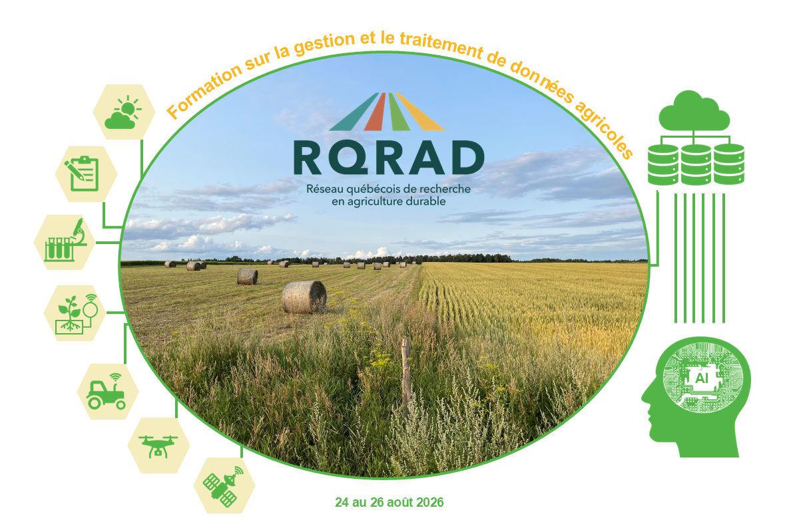

## Bienvenue

Cette page regroupe des guides de démarrage simples pour les outils utilisés dans le cadre de la **formation du RQRAD sur la gestion et le traitement des données agricoles (24--26 août 2026)**. Chaque guide est pensé pour des personnes qui commencent totalement avec l'outil concerné : aucune expérience préalable n'est requise.

::: {style="text-align: right;"}
{width=60%}
:::
## Liste des guides

*Version 1.0.0 — première publication.*

- [R et RStudio](01_r_et_rstudio.qmd) — guide d'installation de R et RStudio et premiers pas d'utilisation de RStudio.
- [GitHub Codespaces](02_github-codespaces.qmd) — créer un codespace à partir d'un dépôt GitHub ou d'un gabarit, découvrir l'interface VS Code intégrée, exécuter des commandes dans le terminal et enregistrer ses changements avec Git.
- [Google Colab](03_google_colab.qmd) — créer un compte Google, ouvrir Google Colab, exécuter un premier programme en Python et gérer des notebooks (renommer, enregistrer, télécharger, partager).
- [Anaconda et Miniconda](04_anaconda_miniconda.qmd) — installer Anaconda ou Miniconda et comprendre le fonctionnement des environnements conda.
- [Spyder](05_spyder.qmd) — installer Spyder dans son propre environnement conda et le connecter à différents environnements de projet à l'aide de `spyder-kernels`.

## Comment utiliser ces guides

1. Cliquez sur le nom de l'outil qui vous intéresse dans la liste ci-dessus ou dans le menu de navigation, en haut de la page.
2. Suivez les étapes dans l'ordre, sans en sauter.
3. Si un terme n'est pas clair, il est généralement expliqué dès sa première apparition dans le guide.
4. En cas de problème, notez l'étape où vous êtes bloqué avant de demander de l'aide.

::: {.callout-tip}
Ces guides sont mis à jour au besoin. Le lien de cette page reste toujours le même, même après une mise à jour du contenu.
:::

## Transparence sur les outils utilisés

::: {.callout-note title="Utilisation d'outils d'intelligence artificielle"}

Ces guides ont été élaborés avec l'appui de **Perplexity**, en sélectionnant le modèle **Claude Sonnet 5**.

Cet outil a servi à soutenir la recherche d'information, la structuration et la révision initiale du contenu. Le contenu a ensuite été vérifié, adapté et organisé pour les besoins de ces guides.

:::

---

<small>
Guides préparés par Andrés F. Silva-Dimaté.  
*Version 1.0 — 2026*
</small>

---

{fig-align="center" width=30%}